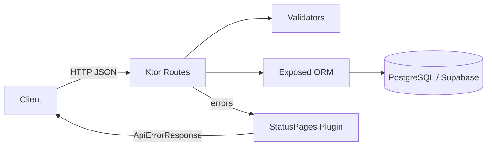

# BakingBuddy Service

Backend service for BakingBuddy — a Kotlin/Ktor API for managing recipes, ingredients, instructions, and bake history, with full version tracking on edits.

**Status:** Work in progress.

## Table of Contents

- [Architecture](#architecture)
- [Setup](#setup)
- [Running the Service](#running-the-service)
- [API](#api)
- [JSON Conventions](#json-conventions)
- [Error Handling](#error-handling)
- [Formatting & Linting](#formatting--linting)
- [Testing](#testing)

## Architecture

The service is built with [Ktor](https://ktor.io/) for HTTP routing, [Exposed](https://github.com/JetBrains/Exposed) as the ORM, and PostgreSQL (hosted via [Supabase](https://supabase.com/)) for persistence. Request/response bodies are serialized with `kotlinx.serialization`.

Domain data (ingredients, instructions) follows a **concept + versioned delta** pattern: each ingredient or instruction has a stable "concept" row plus a history of versioned "delta" rows representing edits over time. A `best_version` pointer on the concept marks which delta is currently active, decoupled from `latest_version` (the next version number to be assigned) — this allows reverting to an earlier version without losing edit history. Bakes reference the specific ingredient/instruction delta versions that were used at the time.



## Setup

### Prerequisites

- Java 21
- PostgreSQL 17.6 (via Supabase CLI)
- [Supabase CLI](https://supabase.com/docs/guides/cli)

### Environment Variables

Create a `.env` file in the project root with:

```dotenv
APP_ENV=
DATABASE_URL=
DATABASE_USER=
DATABASE_PASSWORD=
```

> No `.env.example` exists yet — copy the block above as a starting point.

### Database

Start the local database:

```bash
supabase start
```

If you've made schema changes and need to sync your local database:

```bash
supabase db pull
supabase db reset
```

## Running the Service

```bash
./gradlew run
```

The service runs locally at [http://localhost:8080](http://localhost:8080). Confirm it's up via the health check:

```
GET http://localhost:8080/api/health
```

## API

Full API documentation is available via OpenAPI:

- **Local:** [http://localhost:8080/openapi](http://localhost:8080/openapi)
- **Production:** [https://baking-buddy-service.onrender.com/openapi](https://baking-buddy-service.onrender.com/openapi)

Resources exposed under `/api` include recipes, ingredients, instructions, bakes, and notes. See the OpenAPI spec for the full, current set of endpoints and payloads.

## JSON Conventions

- Keys are `snake_case`.
- Dates use ISO 8601.
- Arrays use plural noun keys.
- Missing/absent values are represented as `null` rather than omitted, in response bodies.
- **On edit (PATCH) requests:** a field explicitly set to `null` means "remove this nullable field"; an **absent** field means "no change." This tri-state (absent / null / value) is implemented via a `PatchField<T>` wrapper type on edit payloads.

## Error Handling

Errors follow a standardized structure and error-code scheme, handled centrally via Ktor's StatusPages plugin.

See the full [error handling documentation](src/main/kotlin/com/bakingbuddy/api/errors/README.md) for the exception hierarchy, error codes, and response envelope format.

## Formatting & Linting

```bash
./gradlew ktlintFormat   # linter
./gradlew detekt         # format
```

## Testing

```bash
./gradlew test
```

Tests use JUnit 5, Kotest assertions, and MockK, prioritizing coverage of business logic (validation, error handling) and route-level behavior.
